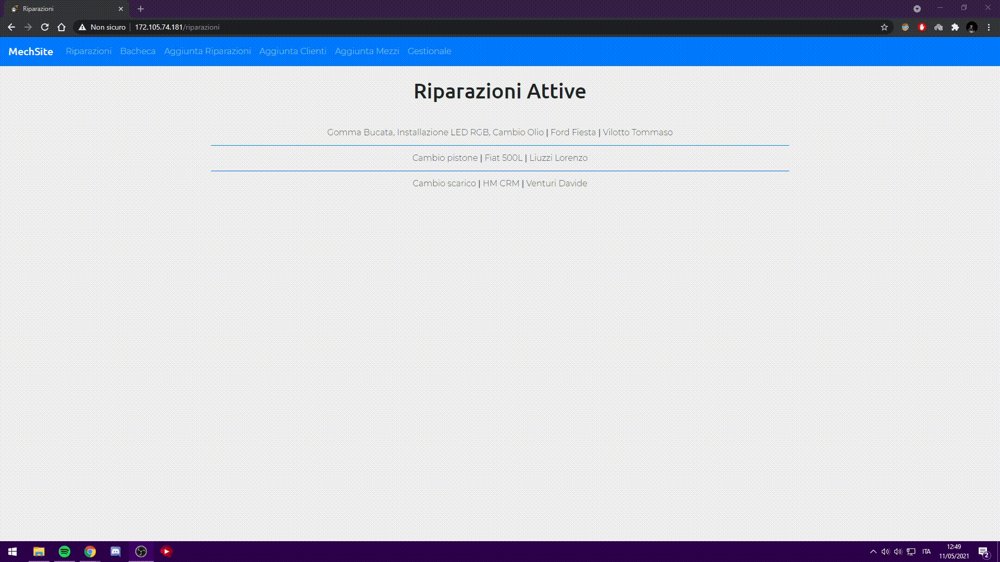

# MechSite

## Index
- [English](#English)
  - [Project Status](#project-status)
  - [Description](#description)
  - [Documentation](#documenttion)
  - [Technlogies](#technologie)
  - [Lenguages](#lenguages)
  - [Architecture](#architecture)
  - [Functionality](#functionality)
  - [Project Structure](#project-structure)
  - [Licence](#licence)
  
- [Italiano](#Italiano)
  - [Status del progetto](#status-del-progetto)
  - [Descrizione](#descrizione)
  - [Documentazione](#documentazione)
  - [Tecnologie](#tecnologie)
  - [Linguaggi](#linguaggi)
  - [Architettura](#architettura)
  - [Funzionalità](#funzionalità-della-piattaforma)
  - [Struttura del progetto](#struttura-del-progetto)
  - [Licenze](#licenze)

## English

## Description

MechSite is...

## Documentation
* Readme.md file
* Gantt chart
* 
* 

## Technologies
* [Flask](https://flask.palletsprojects.com/en/1.1.x): Version 1.?
* [Bootstrap](https://getbootstrap.com): Version 5.0
* [SQLAlchemy](https://www.sqlalchemy.org): Version 1.4
* [Git](https://git-scm.com): Version 2.31.1

## Lenguages
* [Python](https://www.python.org): Version 3.8.6
* [Html](https://html.com): Version 5
* [CSS](https://www.css.com): Version 3
* [JavaScript](https://www.javascript.com): Version ECMAScript 2018

## Architecture

(Linode)

...

## Italiano

## Status del progetto
In fase di completamento

## Descrizione
MechSite è una piattaforma sviluppata per l'ausilio del meccanico, il quale avrà una semplificazione nella gestione del lavoro e dell'organizzazione.
La piattaforma permette inoltre di faar visualizzare a quet'ultimo una sezione denominata "Bacheca" la quale permetterà la visualizzazione delle riparazioni effettuate in precedenza, provviste di Nome cliente, Targa del mezzo e data di quando è stata effettuata.

## Documentazione

* File Readme.md
* Diagramma di Gantt
* 
* 

## Tecnologie

* [Flask](https://flask.palletsprojects.com/en/1.1.x): Version 1.?
* [Bootstrap](https://getbootstrap.com): Version 5.0
* [SQLAlchemy](https://www.sqlalchemy.org): Version 1.4
* [Git](https://git-scm.com): Version 2.31.1

## Linguaggi

* [Python](https://www.python.org): Version 3.8.6
* [Html](https://html.com): Version 5
* [CSS](https://www.css.com): Version 3
* [JavaScript](https://www.javascript.com): Version ECMAScript 2018

## Architettura

(Qui si parla della macchina Linode)

## Funzionalità della piattaforma

La piattaforma è divisa in due sezioni principali:
* Lato Amministrativo
* Lato Cliente

### Lato Amministrativo

All'interno della parte amministrativa saranno disponibili le seguenti funzionalità:
* Aggunta nuovi clienti
* Aggiunta nuovi mezzi
* Aggiunta nuovi interventi
* Visualizzazione di una bacheca che contiene tutti i clienti, i mezzi e gli interventi
* Visualizzazione di una pagina che contiene tutte gli inteventi in corso nel quale è possibile terminare gli interventi
* Possibilità di modificare i dati relativi ai clienti, ai mezzi e agli interventi

#### Aggunta nuovi clienti
All'arrivo di un nuovo cliente l'amministratore potrà utilizzare i dati forniti da quest'ultimo per poterlo inserire all'interno del database.

#### Aggiunta nuovi mezzi
Per l'aggiunta di un nuovo mezzo all'interno del database sarà necessario specificare oltre alle informazioni del mezzo inserire anche il codice fiscale del proprietario del mezzo.
Il codice fiscale a differenza degli altri dati non sarà da inserire scrivendolo, ma sarà selezionabile da una lista di codici fiscali già esistenti.
Se il codice fiscale del proprietario non fosse presente sarà possibile selezionare la voce apposita che reindirizzerà alla sezione dedicata per aggiungerlo.

#### Aggiunta nuovi interventi
Per l'aggiunta di un nuovo intervento sarà necessario specificare oltre alle informazioni dell'intervento anche la targa del mezzo su cui dovrà essere effettuato l'intervento.

Anche in questo caso, la targa del mezzo, a differenza degli altri dati non sarà da inserire scrivendola, ma sarà selezionabile da una lista di targhe già esistenti.
Se la targa del mezzo non fosse presente sarà possibile selezionare la voce apposita che reindirizzerà alla sezione dedicata per aggiungerla.

#### Visualizzazione di una bacheca che contiene tutti i clienti, i mezzi e gli interventi
Al personale amministrativo sarà possibile visualizzare in un unica pagina tutti i clienti, i mezzi e gli interventi registrati.
Sarà anche possibile una ricerca di elementi tramite il codice fiscale del proprietario o tramite la targa di un mezzo, e verranno mostrati tutti i veicoli e le riparazioni di quel codice fiscale, oppure se viene ricercato un veicolo verranno mostrati il proprietario e le riparazioni in corso su esso e anche quelle già terminate.

#### Visualizzazione di una pagina che contiene tutte gli inteventi in corso nel quale è possibile terminare gli interventi
In questa sezione verranno visualizzati tutti gli interventi in corso e sarà possibile terminare un intervento facendo si che il cliente venga informato di ciò tramite un email.
La pagina presenta una lista di interventi e aprendone uno sarà possibile decidere di terminarlo.

#### Possibilità di modificare i dati relativi ai clienti, ai mezzi e agli interventi
Il personale amministrativo potrà anche modificare i dati relativi ai clienti, a mezzi e agli interventi che sono già stati inseriti e quindi che sono già presenti.
Queste operazioni saranno disponibili nella pagina gestionale.

### Lato Cliente

All'interno della parte dedicata al cliente le funzionalità saranno diverse.
Esse saranno limitate al visualizzare le proprie riparazioni e i propri mezzi e alla modifica dei propri dati personali con i quali si esegue l'accesso alla piattaforma.

Al primo accesso alla piattaforma utilizzando la mail fornita in precedenza al personale dell'officina sarà richiesto la creazione e l'inserimento di una password che sarà utilizzata poi per tutti gli accessi seguenti.

Questa password sarà poi modificabie all'interno dell'area dedicata alla modifica del profilo, dove saranno modificabili dall'utente anche i contatti email e numero di telefono.

## Struttura del progetto
(Qui va presentata la struttura delle repository nelle quali si trovano i sorgenti del progetto, le immagini, le gif, il readme ecc..)

## Licenza

### Licenza generale
MIT License

### Autori e copyright
| Autori(in ordine alfabetico)  | Contatto di posta elettronica |
| ------------- | ------------- |
| Aldegheri Alessandro  | xxx@gmail.com |
| Cremonini Davide  | davide.cremonini.14@gmail.com |
| Liuzzi Lorenzo  | lorenzoliuzzi02@gmail.com |
| Venturi Davide  | xxx@gmail.com |

### Licenze software dei componenti di terzi parti

(non so se è realmente necessario metterle, potremmo toglierle volendo)
